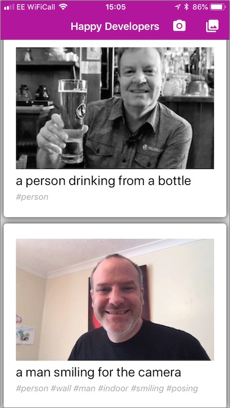

# Mobile Apps of Tomorrow

In this workshop you will build a cloud-connected, AI powered mobile app that runs on iOS, Android and UWP using Xamarin and Xamarin.Forms.

The app you are creating is called __Happy Xamarin Developers__ and is a social-media style image sharing app to share photos of happy Xamarin developers with the world. This app uses a number of Azure cloud services, including Authentication, Cognitive Services, Functions, Blob storage and CosmosDB.

## Prerequisites

* Please make sure you have run through the [setup prerequisites](./SETUP.MD) to configure your development environment before working through this workshop.

* You will also need an Azure account to configure the services required. These services will either be using free tiers, or be very cheap and only needed for the duration of the workshop. If you do not already have an Azure account, you can sign up for a [free Azure account](https://azure.microsoft.com/free?WT.mc_id=mobileappsoftomorrow-workshop-jabenn) to get US$200 of credit on all services for 30 days, plus 12 months of free access for popular services, and unlimited access to 25 free services.

* This app will be authenticated using Facebook. You will need a Facebook account to both configure the authentication, and for all the users who will log in.

* This workshop was written using Visual Studio 2017 v15.7 and Visual Studio for Mac 7.5. If you are using a newer version then the menus, options and dialogs might be different. If you are using an older version, then please update your install if you have any problems.

* This workshop assumes you have at least a basic familiarity with C# and Visual Studio.

## What you will learn

In this lab you will learn how to create a simple, multi-page Xamarin.Forms app that runs on iOS, Android and UWP.

You will learn how to use plug-ins to take advantage or hardware specific features such as the camera, how to use Cognitive Services, and how to wire up an app to a back-end built using Azure functions and Blob storage. On the back-end side, you will learn how to create an API using Azure functions, behind a mobile app service that provides authentication, and how to connect this API up to Cognitive Services, Blob storage and CosmosDB (a globally distributed database system running on Azure).

<!-- TODO - add an architecture diagram -->

## Disclaimer

In this workshop, your instructors will provide you guidance based on many years of experience doing mobile cross platform development with Xamarin. Of course within one single day, we cannot implement all the best practices in development, continuous integration, testing, QA, etc. This workshop is an introduction to cross-platform development with Xamarin and Azure which will get you started you into this fantastic world.

The examples are not production quality - for example you won't be handling exceptions anywhere in the code. You will also be writing functions inside the Azure portal and configuring services directly, whereas in a production app you would want to use CI/CD using services like [VSTS](https://docs.microsoft.com/vsts/index?view=vsts&WT.mc_id=mobileappsoftomorrow-workshop-jabenn) and tools like the [Azure Resource Manager](https://docs.microsoft.com/azure/azure-resource-manager/?WT.mc_id=mobileappsoftomorrow-workshop-jabenn).

We will also not be considering security in too much detail, beyond securing functions behind facebook authentication. For a production app, please refer to the [Azure Security documentation](https://docs.microsoft.com/azure/security/?WT.mc_id=mobileappsoftomorrow-workshop-jabenn) and consider using tools like [Azure Key Vault](https://docs.microsoft.com/azure/key-vault/?WT.mc_id=mobileappsoftomorrow-workshop-jabenn).

For more information on best practices and getting your app to a professional level, we recommend checking the [Xamarin University courses](https://university.xamarin.com/?WT.mc_id=mobileappsoftomorrow-workshop-jabenn).

## Steps

The individual steps are linked below.

1. [Create the solution](./Workshop/1-CreateSolution.md)
2. [Set up an Azure Functions app](./Workshop/2-SetupAzureFunctions.md)
3. [Create an Azure Service inside the mobile app](./Workshop/3-CreateAnAzureServiceInTheMobileApp.md)
4. [Create the Login page](./Workshop/4-CreateLoginPage.md)
5. [Wire up the camera using a Xamarin plugin](./Workshop/5-WireUpTheCamera.md)
6. [Detect faces and emotion using the Azure FaceAPI](./Workshop/6-DetectFaces.md)
7. [Configure storage using Blob storage and CosmosDB](./Workshop/7-ConfigureStorage.md)
8. [Create an Azure Function to save the photos to blob storage](./Workshop/8-FunctionToSavePhotos.md)
9. [Create a blob storage trigger to analyze the photos and save the results to Cosmos DB](./Workshop/9-BlobStorageTrigger.md)
10. [Create some Azure Functions to retrieve photos](./Workshop/10-FunctionToLoadPhotos.md)
11. [Download photos to the mobile app](./Workshop/11-DownloadPhotosToMobileApp.md)
12. [Show the photos on the mobile app](./Workshop/12-ShowPhotosOnMobileApp.md)
13. [Improve the UI](./Workshop/13-ImproveTheUI.md)
14. [Cleaning up](./Workshop/14-CleaningUp.md)

## Cleaning up

During this workshop you will have created different Azure services, and some have an associated cost. The final step contains [instructions to clean up these resources](./Workshop/16-CleaningUp.md), so to save paying unnecessarily, remember to work through this step to delete the resource group you created regardless of how far through the workshop you manage to get.

## Further reading

You can find links to relevant documentation below:

* [Xamarin](https://docs.microsoft.com/xamarin/?WT.mc_id=mobileappsoftomorrow-workshop-jabenn)
* [Azure Functions](https://docs.microsoft.com/azure/azure-functions/?WT.mc_id=mobileappsoftomorrow-workshop-jabenn)
* [Blog Storage](https://docs.microsoft.com/azure/storage/?WT.mc_id=mobileappsoftomorrow-workshop-jabenn)
* [CosmosDB](https://docs.microsoft.com/azure/cosmos-db/?WT.mc_id=mobileappsoftomorrow-workshop-jabenn)
* [AppCenter](https://docs.microsoft.com/appcenter/?WT.mc_id=mobileappsoftomorrow-workshop-jabenn)
* [Cognitive services](https://docs.microsoft.com/azure/cognitive-services/?WT.mc_id=mobileappsoftomorrow-workshop-jabenn)

## Contributors

This lab was built by [Jim Bennett](https://developer.microsoft.com/advocates/jim-bennett?WT.mc_id=mobileappsoftomorrow-workshop-jabenn) and [Laurent Bugnion](https://developer.microsoft.com/advocates/laurent-bugnion?WT.mc_id=mobileappsoftomorrow-workshop-jabenn).

## Version History

| Version | Date | Comments |
|---------|------|----------|
| 1.0     | 23 May 2018 | Initial release |
| 1.1     | 11 June 2018 | Updates after first run to fix bugs and improve clarity |
| 1.2     | 02 March 2019 | Migrated Azure Functions from v1 to v2 |
