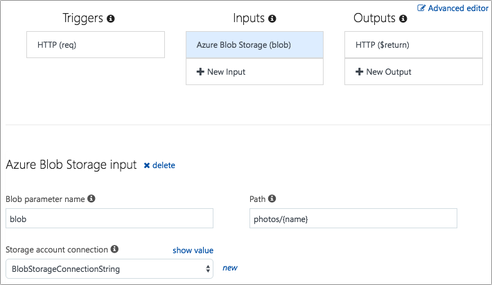

# Creating Azure Function to Load Photos

So far we have an app that can take a photo, check for happy faces then upload the photo to an Azure function that saves it in Blob Storage. A queue trigger is then fired that analyses the photo to get a description and tags, and stores this data in Cosmos DB.

The next step is to show a timeline on the mobile app of all the photos taken. To do this we will need two more APIs, one to retrieve the metadata for all the photos that have been taken, and one to download the Blobs for each photo.

> Having 2 APIs is more efficient as the mobile device can cache images locally and only request new ones that it needs. In a production app you would normally take this further and only return metadata for new photos using some kind of timestamp.

## 1. Creating a function to load metadata for all photos

The first Function to create will return the metadata for all photos using a Cosmos DB function binding - this time an input binding. We will bind a Cosmos DB collection to the input parameter of the Function, either returning the whole collection or just a query. For this Function, you will need the entire collection.

### 1a. Creating the GetAllPhotos function

1. In the browser, navigate to the [Azure Portal](https://portal.azure.com/?WT.mc_id=mobileappsoftomorrow-workshop-jabenn)
2. In the Azure Portal, navigate to **HappyXamDevsFunction-[Your Last Name]**
    - E.g. HappyXamDevsFunction-Minnick

3. In the **Functions** dashboard, on the left-hand menu, click **Functions**
4. In the **Functions** window, click **+ Add New Function**
5. In the **Add new..** window, select **HTTP trigger**
6. In the **Http trigger** slide out, enter the following:
    - **Name:** GetAllPhotos
    - **Authorization level:** Anonymous
7. In the **Http trigger** slide out, click **Create**
8. In the **run.csx editor**, enter the following code:

```csharp
using Microsoft.AspNetCore.Mvc;

public static IActionResult Run(HttpRequestMessage req, IEnumerable<dynamic> documents, ILogger log)
{
    return new OkObjectResult(documents);
}

```
> **About the Code**
>
> `IEnumerable<dynamic> documents` contains all documents from CosmosDb
>
> `return new OkObjectResult(documents)` returns an **OK - 200** message containing the CosmosDb documents in the response body

9. On the **Functions** dashboard, on the left-hand menu, select **GetAllPhotos** > **Integrate**
10. On the **Integrate** window, select **HTTP (req)**
11. On the **HTTP (req)** window, enter the following:
    - **Allowed Http methods:** Selected methods
    - **Request parameter name:** req
    - **Route Template**: photo
    - **Authorization level:** Anonymous
    - **Selected HTTP methods**: Get

    > Note: Uncheck all other **Selected HTTP methods**

12. On the **HTTP (req)** window, click **Save**
13. On the **Integrate** window, under **Inputs**, select **+ New Input**
14. In the **New Input** window, scroll to the bottom and select **Azure Cosmos DB**
15. In the **New Input** window, click **Select**
16. In the **Azure Cosmos DB input** window, enter the following:
    - **_Document parameter name:** documents
    - **Database name:** Photos
    - **Collection name:** PhotoMetadata
    - **Azure Cosmos DB account connection** happyxamdevs-[Your Last Name]_DOCUMENTDB
    - **Document ID:** [Leave Blank]
    - **Partition Key:** [Leave Blank]
    - **SQL Query:** [Leave Blank]
17. In the **Azure Cosmos DB input** window, click **Save**

## Creating a function to load a photo

Next you need a function that will take the name of a Blob and return that Blob, encoded as Base64 to allow it to be returned in a JSON object. Once again, you can use an input binding to bind to Blob storage, even providing a way to automatically take an input parameter passed to the function as a REST resource identifier.

### Creating the GetPhoto function

This function will be routed to the `photo/{name}` REST resource, so making an HTTP GET method call to `https://<YourFunctionApp>.azurewebsites.net/api/photo/<photo name>` with the photo name set to the name of the Blob (taken from the Cosmos DB document) will return that blob.

1. In the **Functions** dashboard, on the left-hand menu, click **Functions**
2. In the **Functions** window, click **+ Add New Function**
3. In the **Add new..** window, select **HTTP trigger**

1. From the Azure Portal, create a new function inside your function app. This will need to be a C# HTTP trigger. Set the _Name_ as "GetPhoto" and the _Authorization level_ as "Anonymous".
2. Head to the _Integrate_ tab and set the _Route Template_ to "photo/{name}". This will allow you to add a parameter called `name` to your function and have this automatically populated with the resource name from the URL.
3. Set the _Selected HTTP Methods_ to GET. The click "Save".

    

### Creating the Blob input binding

1. From the _Integrate Tab_, click the "+ New Input" button under _Inputs_, select _Azure Blob Storage_ and click "Select".
2. Set the _Blob parameter name_ to be "blob". This is the name of the parameter in your function that the Blob will be passed to.
3. Set the _Path_ to be "photos/{name}". This maps to the `photos` Blob collection, and will return the Blob whose name matches the value passed as the `name` from the REST resource.
4. Set the _Storage account connection_ to be your Blob storage connection string. Then click "Save".

    

### Implementing the GetPhoto function

1. Head to the Azure Function code, and update the Function signature to include the new binding and route template parameter by adding two new parameters - a `string` called `name` and a `Stream` called `blob`. These parameters will be populated by the photo name from the URL and the Blob from the input binding.

    ```cs
    public static async Task<HttpResponseMessage> Run(HttpRequestMessage req, string name, Stream blob, TraceWriter log)
    ```

2. Read the contents of the Blob stream and encode it as a Base64 string.

    ```cs
    var bytes = new byte[blob.Length];
    await blob.ReadAsync(bytes, 0, Convert.ToInt32(blob.Length));
    var photo = Convert.ToBase64String(bytes);
    ```

3. Create a new anonymous object containing the photo and return it as part of the HTTP response. Then save the function.

    ```cs
    var retVal = new
    {
        Photo = photo
    };
    return req.CreateResponse(HttpStatusCode.OK, retVal);
    ```

The complete code for this function is below.

```cs
using System.Net;

public static async Task<HttpResponseMessage> Run(HttpRequestMessage req, string name, Stream blob, TraceWriter log)
{
    var bytes = new byte[blob.Length];
    await blob.ReadAsync(bytes, 0, Convert.ToInt32(blob.Length));
    var photo = Convert.ToBase64String(bytes);

    var retVal = new
    {
        Photo = photo
    };
    return req.CreateResponse(HttpStatusCode.OK, retVal);
}
```

## Next step

Now that you have functions to download photo metadata and individual photos, the next step is to [use these in your Xamarin app to download photos](./11-DownloadPhotosToMobileApp.md).
