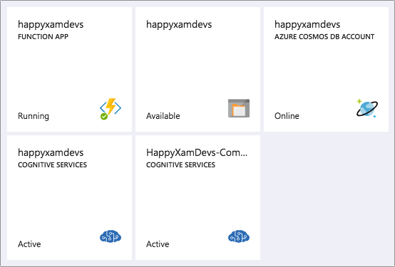
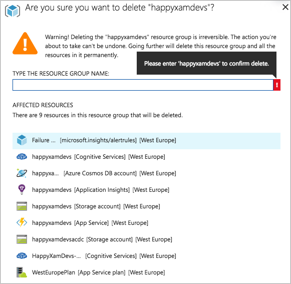

# Cleaning up your Azure resources

During this workshop you create a number of different Azure resources - AI services, a Function app, Blob storage and a Cosmos DB database. You could leave these services running, but this will cost money - not much, but will still eat away at any Azure credit you have. Now is a good time to clean up these resources to save money.

When you created your resources, you did so under the same resource group. Resource groups are logical groupings of resources that you can manage as one - such as deleting a resource group and all its resources in one go.

1. From the Azure Portal, select _Resource Groups_ from the left-hand menu.
2. Select your resource group from the list. You should see the details of this resource group with all your resources in it.
3. Click _Delete resource group_ option from the top menu for the resource group.
4. A pane will slide out on the right-hand side asking for confirmation, showing all the resources that will be deleted. To confirm, enter your resource group name into the box and click "Delete"

    