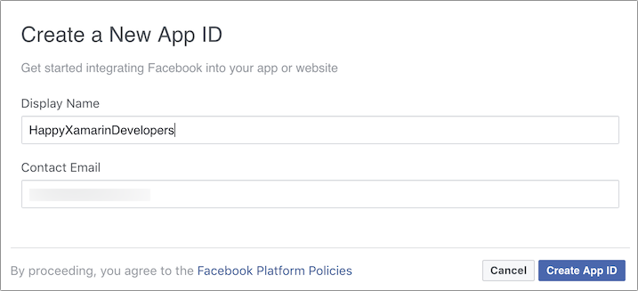

# Set up an Azure Functions app

For this app, you will create an Azure Functions app as a back-end. This back-end will use Facebook authentication, meaning that any calls to Functions inside this app will only be permitted from authenticated users.

## Create the Functions app in the Azure portal

1. Log in to the [Azure portal](https://portal.azure.com/?WT.mc_id=mobileappsoftomorrow-workshop-jabenn)
2. Click _Create a resource_ on the toolbar on the left (if your toolbar is collapsed this will be shown as a green +).
3. Type "Function app" into the _Search the marketplace_ box and press return. Select _Function App_ from the results, then click "Create".

   
4. Enter a name for your Function app. This will need to be unique across the whole of Azure as this will become an actual sub-domain of `azurewebsites.net`. The edit control has a built in validator-if the app name is unique you will see a green tick on the right.
5. Select your subscription.

    > Note: As a reminder, if you don't have an Azure account, [you can create a free one](https://azure.microsoft.com/free?WT.mc_id=mobileappsoftomorrow-workshop-jabenn).

6. Ensure the resource group is set to _Create new_, and enter a name (or use the default provided). You can re-use this same resource group for all services created for this workshop, making it easier to [clean up after you are finished](./14-CleaningUp.md).
7. Leave the OS set to _Windows_
8. Leave the _Hosting Plan_ set to consumption.
9. Select a location closest to you.
10. Ensure _Create new_ is selected for the storage, and enter a name (or use the default).
11. Leave Application Insights turned on.
12. Check the _Pin to dashboard_ checkbox.
13. Click "Create".

    

The app will be provisioned, and you will be taken back to the Azure dashboard where you can see the provisioning in progress. This should only take a minute or so, and you will be notified once done.

## Configure Facebook authentication

Once the Function app has been provisioned, open it and you will see an overview of your Function app, with no functions created. Note the URL of your app - it will be the value you use when configuring Facebook authentication and creating your Xamarin mobile app.

### Set up Facebook

To set up authentication using Facebook, you will need to create an app in Facebook and configure it there.

1. Head to [the Facebook Developer portal](https://developers.facebook.com/) and log in with a Facebook account.

2. Select _My Apps->Add new app_, give your app a name, enter a contact email address and click "Create App Id". You may need to do a Captcha as well.

   

3. Add _Facebook Login_ to your app by finding the _Facebook Login_ option and clicking "Set Up".

   

4. Facebook login will appear under _Products_ on the left-hand side. Select _Settings_. Set the _Valid OAuth Redirect URIs_ to the URL that you copied earlier in the Azure portal, suffixed with `/.auth/login/facebook/callback` - for example `https://happyxamdevs.azurewebsites.net/.auth/login/facebook/callback`. Then click "Save changes".

5. In the upper section on the left hand side, expand the _Settings_ and select _Basic_. You will need the _App ID_ and the _App Secret_ from here. Click the "Show" button next to the app secret to see it.

> Note: Yes, there are two menus called _Settings_ on the left hand side. Step 4 refers to the one at the bottom while step 5 refers to the one on top.

### Set up the Function app authentication

Now that you have your app configured in Facebook, head back to the Azure portal to configure your Function app.

1. From the Function App, select the _Platform features_ tab, and select _Authentication/Authorization_ under _Networking_.

2. Turn _App service authentication_ __On__.

3. Set the _Action to take when request is not authenticated_ to _Log in with Facebook_.

4. Click the _Facebook_ option to configure it.

5. Enter your _App ID_ and _App secret_ from your Facebook app into the corresponding fields, then tick the scope you want. This scope is the fields you want access to from Facebook. For now just select _public profile_ as we don't want any private data. Then click "OK".

6. In the _Allowed external redirect URLs_ field, enter `happyxamdevs://easyauth.callback`. This is the callback that will be made by the authentication flow, and your mobile app can be configured to handle this URI.

7. Click "Save".

> If you prefer to authenticate with another provider, here are the instructions for [Twitter](https://docs.microsoft.com/azure/app-service/app-service-mobile-how-to-configure-twitter-authentication/?WT.mc_id=mobileappsoftomorrow-workshop-jabenn), for [Google](https://docs.microsoft.com/azure/app-service/app-service-mobile-how-to-configure-google-authentication/?WT.mc_id=mobileappsoftomorrow-workshop-jabenn), and for [Microsoft accounts](https://docs.microsoft.com/azure/app-service/app-service-mobile-how-to-configure-microsoft-authentication/?WT.mc_id=mobileappsoftomorrow-workshop-jabenn).

## Next step

Now you have your Azure Function App created, the next step is to [create an Azure Service inside the mobile app](./3-CreateAnAzureServiceInTheMobileApp.md).