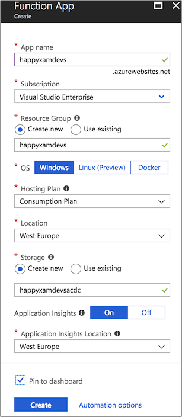

# Set up an Azure Functions app

For this app, we will create an Azure Functions app as a back-end.

This back-end will use Facebook authentication, meaning that any calls to Functions inside this app will only be permitted from authenticated users.

## 1. Create the Functions app in the Azure portal

1. In your browser, navigate to the [Azure portal](https://portal.azure.com/?WT.mc_id=mobileappsoftomorrow-workshop-jabenn)

2. On the left-hand toolbar, click **Create a resource**  

> **Note:** If the toolbar is collapsed, it will be shown as a green **+**

3. In the **Search the marketplace** box, type **Function app**  

4. Tap the **Return** key on the keyboard

5. In the search results, select **Function App**

6. At the bottom of the **Function App** window, click **Create**

   

7. In the **Function App** window, make the following selections:

    - **App Name**: XamHappyDevsFunction_[Your Last Name]

    > **Note:** App Name needs to be unique because this will be used as the domain for your Functions App. If the App Name entered is unique, you will see a green tick on the right; if not, you will see a red **X**

    - **Subscription**: [Select your Azure Subscription]

    > Note: As a reminder, if you don't have an Azure account, [you can create a free one](https://azure.microsoft.com/free?WT.mc_id=mobileappsoftomorrow-workshop-jabenn).

    - **Resource Group**
        - **Create new**
        - **Name:** XamHappyDevs
    - **OS:** Windows
    - **Hosting Plan:** Consumption
    - **Location:** West US
    - **Runtime Stack**: .NET
    - **Storage** 
        - **Create New**
        - XamHappyDevsStorage
    - **Applictaion Insights**
        - **Disabled**

8. Click **Create**

    

9. Standby while for a few minutes while the app is provisioned

## 2. Setup Facebook Authentication

1. Once the Function app has been provisioned, open it

2. Locate the overview of your Function app, with no functions created

3. Copy the URL of your Function App
    - We will use these values later when configuring the Facebook authentication and again when creating our Xamarin mobile app

### 1. Set up Facebook App

To set up authentication using Facebook, you will need to create an app in Facebook and configure it there.

1. In your browser, navigate to [the Facebook Developer portal](https://developers.facebook.com/)

2. Click **Log in**
    > **Note:** The **Log In** button may be in the **≡** menu
    
    > **Note:** If you are already logged into Facebook, skip this step

3. On the login page, enter your Facebook username & password

    > **Note:** If you are already logged into Facebook, skip this step

4. On the **Facebook for Developers** page, expand the browser until the **≡** menu disappears

5. On the **Facebook for Developers** page, select **My Apps** > **Add new app**

6. In the **Create a New App ID** prompt, enter the following: 
    - **App Name**: HappyXamDevs
    - **Contact Email**: [Your email address]

7. Click **Create App Id**

8. If prompted, completed the **Security Check**

9. On the **Facebook For Developers Dashboard**, select **Integrate Facebook Login** > **Confirm**

10. On the left-hand menu, select **Facebook Login** > **Settings**

11. On the **Client OAuth Settings** menu, make the following sections:

    - **Client OAuth Login**: Yes
    - **Web OAuth Login**: Yes
    - **Enforce Https**: Yes
    - **Force Web OAuth Reauthentication**: No
    - **Embedded Browser OAuth Login**: No
    - **Use Strict Mode for Redirect URIs**: Yes
    - **Valid OAuth Redirect URIs**: https://[Your Azure Function Domain]/.auth/login/facebook/callback
        - E.g. `https://xamarainhappydevsfunction_bennett/.auth/login/facebook/callback`

12. Click **Save Changes**

13. On the **Facebook For Developers Dashboard**, select **Settings** > **Basic**

14. Copy the **App Id** and **App Secret**
    - We will use these values later when configuring the Azure Functions Authentication

### Setup Function App Authentication

Now that you have your app configured in Facebook, head back to the Azure portal to configure your Function app.

1. In your browser, navigate to the [Azure portal](https://portal.azure.com/?WT.mc_id=mobileappsoftomorrow-workshop-jabenn)

2. In the Azure Portal, navigate to your Function App, **XamHappyDevsFunction_[Your Last Name]**

# ***TODO***

3. From the Function App, select the _Platform features_ tab, and select _Authentication/Authorization_ under _Networking_.

2. Turn _App service authentication_ __On__.

3. Set the _Action to take when request is not authenticated_ to _Log in with Facebook_.

4. Click the _Facebook_ option to configure it.

5. Enter your _App ID_ and _App secret_ from your Facebook app into the corresponding fields, then tick the scope you want. This scope is the fields you want access to from Facebook. For now just select _public profile_ as we don't want any private data. Then click "OK".

6. In the _Allowed external redirect URLs_ field, enter `happyxamdevs://easyauth.callback`. This is the callback that will be made by the authentication flow, and your mobile app can be configured to handle this URI.

7. Click "Save".

> If you prefer to authenticate with another provider, here are the instructions for [Twitter](https://docs.microsoft.com/azure/app-service/app-service-mobile-how-to-configure-twitter-authentication/?WT.mc_id=mobileappsoftomorrow-workshop-jabenn), for [Google](https://docs.microsoft.com/azure/app-service/app-service-mobile-how-to-configure-google-authentication/?WT.mc_id=mobileappsoftomorrow-workshop-jabenn), and for [Microsoft accounts](https://docs.microsoft.com/azure/app-service/app-service-mobile-how-to-configure-microsoft-authentication/?WT.mc_id=mobileappsoftomorrow-workshop-jabenn).

## Next step

Now you have your Azure Function App created, the next step is to [create an Azure Service inside the mobile app](./3-CreateAnAzureServiceInTheMobileApp.md).