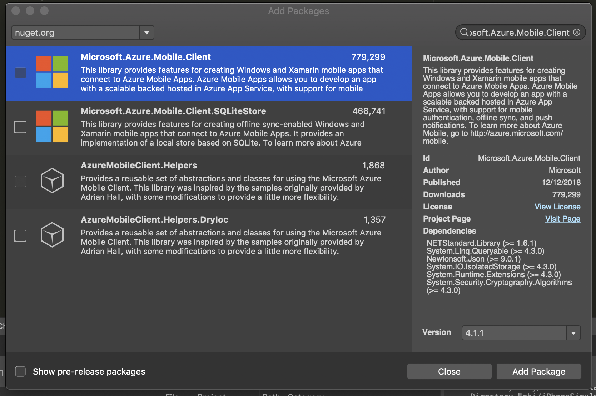

# Create Mobile App Azure Service

Now that our Azure Function App is configured for authentication, we will implement authentication inside our mobile app. 

We'll be using the [Microsoft.Azure.Mobile.Client](https://www.nuget.org/packages/Microsoft.Azure.Mobile.Client/) NuGet package to help with authentication, as well as to call Azure Functions as an authenticated user.

## 1. Install NuGet Packages

1. Open the Xamarin.Forms app in Visual Studio

    > **Note:** The completed app from Section 1 is available in **FinishedWorkshopSteps** > **1-CreateSolution**

2. (PC) In Visual Studio, right-click the `HappyXamDevs` solution > **Manage NuGet Packages For Solution..**

    - (Mac) In Visual Studio for Mac, right-click the `HappyXamDevs` project > **Add** > **Add NuGet Packages**

3. (PC) In the **NuGet Package Manager** window, select **Browse**

    - (Mac) _Skip this step_

4. In the **NuGet Package Manager** window, in the search bar, enter **Microsoft.Azure.Mobile.Client**

5. In the **NuGet Package Manager** window, in the search results, select **Microsoft.Azure.Mobile.Client**

6. (PC) In the **NuGet Package Manager** window, select **Install**

  

- (Mac) In the **NuGet Package Manager** window, select **Add Package**

  

7. (PC) _Skip this step_

    - (Mac) In Visual Studio for Mac, right-click the `HappyXamDevs.Android` project > **Add** > **Add NuGet Packages**

8. (PC) _Skip this step_

    - (Mac) In the **NuGet Package Manager** window, in the search results, select **Microsoft.Azure.Mobile.Client**


9. (PC) _Skip this step_

    - (Mac) In the **NuGet Package Manager** window, select **Add Package**

10. (PC) _Skip this step_

    - (Mac) In Visual Studio for Mac, right-click the `HappyXamDevs.iOS` project > **Add** > **Add NuGet Packages**

11. (PC) _Skip this step_

    - (Mac) In the **NuGet Package Manager** window, in the search results, select **Microsoft.Azure.Mobile.Client**


12. (PC) _Skip this step_

    - (Mac) In the **NuGet Package Manager** window, select **Add Package**

# TODO - Delete The `System.Net.Http` Reference Steps?
This NuGet package has a dependency on `System.Net.Http`, so you will need to reference this in your iOS and Android apps (UWP doesn't need this reference).

* For Visual Studio 2017 on Windows, expand the `HappyXamDevs.iOS` project, right-click on the _References_ node and select _Add Reference..._. Select _Assemblies->Framework_ on the tree on the left and find `System.Net.Http` in the list and check the box next to it, then click "OK".

   

* For Visual Studio for Mac, expand the `HappyXamDevs.iOS` project, right-click on the _References_ node and select _Edit References..._. Select the _Pacxkages_ tab and find `System.Net.Http` in the list and check the box next to it, then click "OK".

   

Repeat these steps for the `HappyXamDevs.Android` project.

To help keep all back-end code in one place, you'll be creating a single `AzureService` that will wrap all interactions with the back end. The majority of this code will be cross-platform, but the authentication part will need some platform-specific code as it will launch a web view to authenticate with Facebook.

<!-- TODO - add a diagram of login flow with a description. Mention about web view best practice as it hides credentials from the app, also can be used for saved passwords -->

## 2. Create a cross-platform Azure service

1. In the Visual Studio Solution Explorer, right-click on the `HappyXamDevs` project > **Add** > **New Folder**

2. In the Visual Studio Solution Explorer, name the new folder `Services`

3. In the Visual Studio Solution Explorer, right-click on the newly created `Services` folder > **Add** > **Class**

    - (Mac) On Visual Studio for Mac, right-click on the newly created `Services` folder > **Add** > **New File**

4. In the **Add New Item** window, name the file `IAzureService.cs`

5. (PC) In the **Add New Item** window, click **Add**
    - (Mac) In the **Add New Item** window, click **New**

6. In the `IAzureService.cs` editor, add the following code"

```csharp
using System.Threading.Tasks;

namespace HappyXamDevs.Services
{
    public interface IAzureService
    {
        bool IsLoggedIn();
        Task<bool> Authenticate();
    }
}
```

> **Note:** `IsLoggedIn` will return `true` if there is currently a user logged in, `false` if not.
> **Note:** `Authenticate` will return `true` if the user is successfully authenticated and `false` if not. This will be an asynchronous method, so the return value will be wrapped in a `System.Threading.Tasks.Task`. 

7. In the Visual Studio Solution Explorer, right-click on the newly created `Services` folder > **Add** > **Class**

    - (Mac) On Visual Studio for Mac, right-click on the newly created `Services` folder > **Add** > **New File**

8. In the **Add New Item** window, name the file `AzureServiceBase.cs`

9. (PC) In the **Add New Item** window, click **Add**
    - (Mac) In the **Add New Item** window, click **New**

10. In the `AzureServiceBase.cs` editor, add the following code:

```csharp
using System.Threading.Tasks;
using Microsoft.WindowsAzure.MobileServices;

namespace HappyXamDevs.Services
{
    public abstract class AzureServiceBase : IAzureService
    {
        protected const string AzureAppName = "[Your Function App Name]";
        protected readonly static string FunctionAppUrl = $"https://{AzureAppName}.azurewebsites.net";

        public MobileServiceClient Client { get; }

        protected AzureServiceBase()
        {
            Client = new MobileServiceClient(FunctionAppUrl);
        }

        public bool IsLoggedIn()
        {
            return Client.CurrentUser != null;
        }

        public async Task<bool> Authenticate()
        {
            if (IsLoggedIn()) return true;
            await AuthenticateUser();
            return IsLoggedIn();
        }

        protected abstract Task AuthenticateUser();
    }
}
```

> **About The Code** 

>`string AzureAppName` and `string FunctionAppUrl` will be used in the platform-specific projects to connect to your Function back end

> `MobileServiceClient Client` provides APIs for authentication, information about the current user, and back-end services

> `bool IsLoggedIn()` verifies that `Client` has a valid current user

> `abstract Task AuthenticateUser()` will be implemented in our Android, iOS and/or UWP projects later

> `Task<bool> Authenticate()` first checks to see if there already is a logged in user, and if not call the `AuthenticateUser()` 

11. In the `AzureServiceBase.cs` editor, replace `[Your Function App Name]` with the name of your Azure Function App
    - E.g. `HappyXamDevsFunction-Minnick`

## Next step

The next step is to implement the platform-specific code to launch a web view to allow the user to authenticate with Facebook. You can see these steps here:

* [For Android](./3_1-CreateAnAzureServiceInTheMobileAppDroid.md)
* [For iOS](./3_2-CreateAnAzureServiceInTheMobileAppIos.md)
* [For Windows](./3_3-CreateAnAzureServiceInTheMobileAppWin.md)
