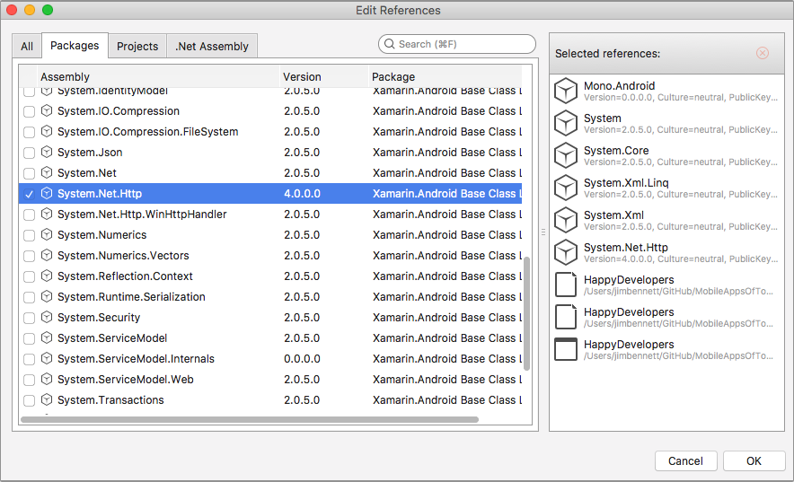
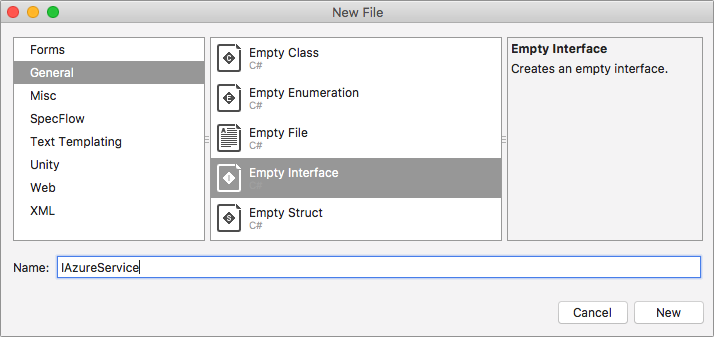

# Create an Azure service inside the mobile app to implement the login flow

Now that your Function app is configured for authentication, it's time to implement this inside your mobile app. You'll be using the [__Microsoft.Azure.Mobile.Client__](https://www.nuget.org/packages/Microsoft.Azure.Mobile.Client/) NuGet package to help with authentication, as well as to call Azure Functions as an authenticated user.

Before you can install this NuGet package you will need to install a Android support library package that is used by the Mobile Client package - this is to get round a quirk with NuGet dependencies and Android.

* For Visual Studio 2017 on Windows, right-click on the `HappyXamDevs.Android` Android app in the solution explorer, select _Manage NuGet packages..._, head to the _Browse_ tab, enter "Xamarin.Android.Support.CustomTabs" into the search box, select the relevant package from the search results and click "Install".

  

* For Visual Studio for Mac, right-click on the `HappyXamDevs.Android` project and select _Add->Add NuGet Packages..._. Enter "Xamarin.Android.Support.CustomTabs" into the search box, select the relevant package from the search results, and click "Add Package".

Next, install the "Microsoft.Azure.Mobile.Client" NuGet package.

* For Visual Studio 2017 on Windows, right-click on the solution in the solution explorer, select _Manage NuGet packages for solution..._, head to the _Browse_ tab, enter "Microsoft.Azure.Mobile.Client" into the search box, select the relevant package from the search results, tick all the projects in the solution and click "Install".

  

* For Visual Studio for Mac, right-click on the `HappyXamDevs` project and select _Add->Add NuGet Packages..._. Enter "Microsoft.Azure.Mobile.Client" into the search box, select the relevant package from the search results, and click "Add Package". Repeat this for all the projects in the solution.
  > To make managing NuGet packages easier with Visual Studio for Mac, there is an extension you can install called _NuGet Package Management Extensions_. If you add this extension you will be able to add, remove and update NuGet packages at the solution level."

This NuGet package has a dependency on `System.Net.Http`, so you will need to reference this in your iOS and Android apps (UWP doesn't need this reference).

* For Visual Studio 2017 on Windows, expand the `HappyXamDevs.iOS` project, right-click on the _References_ node and select _Add Reference..._. Select _Assemblies->Framework_ on the tree on the left and find `System.Net.Http` in the list and check the box next to it, then click "OK".

   

* For Visual Studio for Mac, expand the `HappyXamDevs.iOS` project, right-click on the _References_ node and select _Edit References..._. Select the _Pacxkages_ tab and find `System.Net.Http` in the list and check the box next to it, then click "OK".

   

Repeat these steps for the `HappyXamDevs.Android` project.

To help keep all back-end code in one place, you'll be creating a single `AzureService` that will wrap all interactions with the back end. The majority of this code will be cross-platform, but the authentication part will need some platform-specific code as it will launch a web view to authenticate with Facebook.

<!-- TODO - add a diagram of login flow with a description. Mention about web view best practice as it hides credentials from the app, also can be used for saved passwords -->

## Create a cross-platform Azure service

1. Inside the `HappyXamDevs` project, create a folder called `Services` by right-clicking on the project and selecting _Add->New Folder_.

2. Inside the `Services` folder, create a new interface called `IAzureService`.

   * For Visual Studio 2017, right-click on the `Services` folder, select _Add->New Item..._, ensure _Visual C# Items_ is selected in the tree on the left, select _Interface_, enter the name `IAzureService` and click "Add".

   

   * For Visual Studio for Mac, right-click on the `Services` folder, select _Add->New File..._, ensure _General_ is selected in the tree on the left, select _Empty Interface_, enter the name `IAzureService` and click "New".

   

3. Mark the interface as `public` and add two methods, one to authenticate a user, the other to check if a user is currently logged in.
   * The `IsLoggedIn` method will return `true` if there is currently a user logged in, `false` if not.
   * The `Authenticate` method will return `true` if the user is successfully authenticated and `false` if not. This will be an asynchronous method, so the return value will be wrapped in a `Task`. You will need to add a using directive for the `System.Threading.Tasks` namespace.

    ```cs
    using System.Threading.Tasks;

    namespace HappyXamDevs.Services
    {
        public interface IAzureService
        {
            bool IsLoggedIn();
            Task<bool> Authenticate();
        }
    }
    ```

4. Create a new class inside the services folder called `AzureServiceBase`. This will contain most of the implementation of this interface, but later we will add some platform-specific code to derived classes.

   * For Visual Studio 2017, right-click on the `Services` folder, select _Add->Class..._, enter the name `AzureServiceBase` and click "Add".

   * For Visual Studio for Mac, right-click on the `Services` folder, select _Add->New File..._, ensure _General_ is selected in the tree on the left, select _Empty Class_, enter the name `AzureServiceBase` and click "New".

5. Mark this class as `public abstract`, then implement the `IAzureService` interface, as shown below. We will add code to these methods a little later.

    ```cs
    using System.Threading.Tasks;

    namespace HappyXamDevs.Services
    {
        public abstract class AzureServiceBase : IAzureService
        {
            public bool IsLoggedIn()
            {
            }

            public Task<bool> Authenticate()
            {
            }
        }
    }
    ```

   > Visual Studio has tools to auto-implement interfaces. After adding `: IAzureService` to your class declaration, position the cursor inside the interface name and press _Alt+Enter_. A popup menu will appear with an option to implement the interface automatically.

6. Add some protected strings at the top of your class for the name and URL of your function app. These will be used in platform-specific code to connect to your Function back end, so it makes sense to have them defined in one place. The code shown below assumes your Azure Functions app was called `happyxamdevs`. You will need to replace the value of the `AzureAppName` string with the actual name of your Functions app.

    ```cs
    protected const string AzureAppName = "happyxamdevs";
    protected readonly static string FunctionAppUrl = $"https://{AzureAppName}.azurewebsites.net";
    ```

7. Add a property to the class for the mobile service client. This is a class that provides wrappers around authentication, information about the current user, as well as helpers to interact with back-end services as an authenticated user. Add a constructor and in the constructor set up the `Client` property.

    ```cs
    public MobileServiceClient Client { get; }

    protected AzureServiceBase()
    {
        Client = new MobileServiceClient(FunctionAppUrl);
    }
    ```

    This property needs to be `public` as we will need access to it to wire up the authentication flow. The setter is not needed as the property is initialized inside the constructor and is therefore read-only. You will also need to add `using Microsoft.WindowsAzure.MobileServices;` to the top of the file to reference the namespace that `MobileServiceClient` comes from.

8. Implement the `IsLoggedIn` method that we added earlier by checking to see if the `Client` has a valid current user:

    ```cs
    public bool IsLoggedIn()
    {
        return Client.CurrentUser != null;
    }
    ```

9. Add an abstract method to authenticate the current user. This will be implemented in platform-specific code later.

    ```cs
    protected abstract Task AuthenticateUser();
    ```

10. Implement the `Authenticate` method. This will first check to see if there already is a logged in user, and if not call the abstract `AuthenticateUser` method, before returning if there is now a user logged in. This asynchronous method will `await` the call to the `AuthenticateUser` method, so you should mark it as `async`.

    ```cs
    public async Task<bool> Authenticate()
    {
        if (IsLoggedIn()) return true;
        await AuthenticateUser();
        return IsLoggedIn();
    }
    ```

The full code for this class is below:

```cs
using System.Threading.Tasks;
using Microsoft.WindowsAzure.MobileServices;

namespace HappyXamDevs.Services
{
    public abstract class AzureServiceBase : IAzureService
    {
        protected const string AzureAppName = "happyxamdevs";
        protected readonly static string FunctionAppUrl = $"https://{AzureAppName}.azurewebsites.net";

        public MobileServiceClient Client { get; }

        protected AzureServiceBase()
        {
            Client = new MobileServiceClient(FunctionAppUrl);
        }

        public bool IsLoggedIn()
        {
            return Client.CurrentUser != null;
        }

        public async Task<bool> Authenticate()
        {
            if (IsLoggedIn()) return true;
            await AuthenticateUser();
            return IsLoggedIn();
        }

        protected abstract Task AuthenticateUser();
    }
}
```

## Next step

The next step is to implement some platform-specific code to launch a web view to allow the user to authenticate with Facebook. You can see these steps here:

* [For Android](./3_1-CreateAnAzureServiceInTheMobileAppDroid.md)
* [For iOS](./3_2-CreateAnAzureServiceInTheMobileAppIos.md)
* [For Windows](./3_3-CreateAnAzureServiceInTheMobileAppWin.md)
