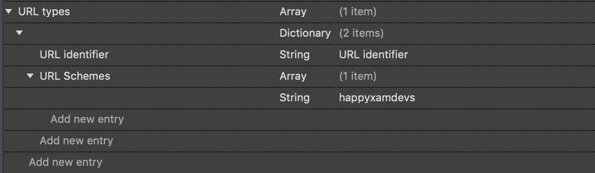

# Implement an iOS-specific version of the AzureService

> **Warning:** Complete steps in [3-CreateAnAzureServiceInTheMobileApp](./3-CreateAnAzureServiceInTheMobileApp.md) before beginning the steps below

## 1. Creating AzureService.cs

1. In the Visual Studio Solution Explorer, right-click on the `HappyXamDevs.iOS` project > **Add** > **New Folder**

2. In the Visual Studio Solution Explorer, name the new folder `Services`

3. (PC) In the Visual Studio Solution Explorer, right-click on the newly created `Services` folder > **Add** > **Class**
    - (Mac) On Visual Studio for Mac, right-click on the newly created `Services` folder > **Add** > **New File**

4. In the Add New Item window, name the new file `AzureService.cs`

5. In the `AzureService.cs` editor, enter the following code:

```csharp
using System.Threading.Tasks;
using CoreFoundation;
using HappyXamDevs.Services;
using Microsoft.WindowsAzure.MobileServices;
using UIKit;

[assembly: Xamarin.Forms.Dependency(typeof(HappyXamDevs.iOS.Services.AzureService))]
namespace HappyXamDevs.iOS.Services
{
    public class AzureService : AzureServiceBase
    {
        protected override async Task AuthenticateUser()
        {
            var currentViewController = await GetCurrentViewController();

            await Client.LoginAsync(currentViewController,
                                    MobileServiceAuthenticationProvider.Facebook,
                                    "happyxamdevs");
        }

        private static Task<UIViewController> GetCurrentViewController()
        {
            var tcs = new TaskCompletionSource<UIViewController>();

            DispatchQueue.MainQueue.DispatchAsync(() =>
            {
                var rootController = UIApplication.SharedApplication.KeyWindow.RootViewController;

                switch (rootController.PresentedViewController)
                {
                    case UINavigationController navigationController:
                        tcs.SetResult(navigationController.TopViewController);
                        break;

                    case UITabBarController tabBarController:
                        tcs.SetResult(tabBarController.SelectedViewController);
                        break;

                    case null:
                        tcs.SetResult(rootController);
                        break;

                    default:
                        tcs.SetResult(rootController.PresentedViewController);
                        break;
                }
            });

            return tcs.Task;
        }
    }
}
```

> **About the Code**
>
> `AuthenticateUser()` calls `LoginAsync()` to allow the user to authenticate via Facebook
>
> `GetCurrentViewController()` returns the `UIViewController` (aka the UI page) that is currently showing on the screen. This uses `DispatchQueue.MainQueue.DispatchAsync` to ensure it runs on the Main Thread.

## 2. Configuring Info.plist

We will configure the callback URL scheme in `info.plist`.

1. In the Visual Studio Solution Explorer, open the following file: **HappyXamDevs.iOS** > **Info.plist**

2. In the `Info.plist` editor, locate the **Bundle Identifier**
    - E.g. `com.companyname.happyxamdevs`

3. (PC) In the `Info.plist` editor, select the **Advanced** tab
    - (Mac) In the `Info.plist` editor, select the **Source** tab

4. (PC) In the `Info.plist` editor's **Advanced** tab, expand the **URL Types** drop-down
    - (Mac) In the `Info.plist` editor's **Source** tab, at the bottom, double-click **Add new entry**

5. (PC) In the **URL Types** drop-down, click **Add URL Type**
    - (Mac) In the **Custom Property** drop-down, select **URL Types**

6. (PC) In the **Add URL Type** menu, add the following:
    - **Identifier**: [Your Bundle Identifier]
        - E.g. `com.companyname.happyxamdevs`
    - **URL Schemes**: happyxamdevs

7. (Mac) On the keyboard, press **Return**

8. (PC) In Visual Studio, save the changes to `Info.plist` by selecting **File** > **Save All**
    - (Mac) In the **Document Role** drop-down, select **URL Identifier**

9. (PC) _Skip this step_
    - (Mac) In the **URL Identifier** property field, enter [Your Bundle Id]
        - E.g. `com.companyname.happyxamdevs`

10. (PC) _Skip this step_
    - (Mac) Under **URL Identifier**, double-click **Add new entry**

11. (PC) _Skip this step_
    - (Mac) In the new **Document Role** drop-down, select **URL Schemes** 

12. (PC) _Skip this step_
    - (Mac) On the keyboard, press **Return**

13. (PC) _Skip this step_
    - (Mac) In the empty `string` field right + below **URL Schemes**, enter `happyxamdevs`

14. (PC) _Skip this step_

    

    - (Mac) In Visual Studio for Mac, save the changes to `Info.plist` by selecting **File** > **Save All**


    


    > **Note:** The URL Scheme `happyxamdevs` matches the settings configured for the Facebook App's  **Allowed external redirect URLs**

15. In the Visual Studio Solution Explorer, open **HappyXamDevs.iOS** > **AppDelegate.cs**

16. In the **AppDelegate.cs** editor, add the following code:
```csharp
using Foundation;
using HappyXamDevs.iOS.Services;
using HappyXamDevs.Services;
using Microsoft.WindowsAzure.MobileServices;
using UIKit;

namespace HappyXamDevs.iOS
{
    [Register(nameof(AppDelegate))]
    public partial class AppDelegate : global::Xamarin.Forms.Platform.iOS.FormsApplicationDelegate
    {
        public override bool OpenUrl(UIApplication app, NSUrl url, NSDictionary options)
        {
            var azureService = Xamarin.Forms.DependencyService.Get<IAzureService>() as AzureService;
            return azureService.Client.ResumeWithURL(url);
        }

        public override bool FinishedLaunching(UIApplication app, NSDictionary options)
        {
            global::Xamarin.Forms.Forms.Init();
            LoadApplication(new App());

            return base.FinishedLaunching(app, options);
        }
    }
}
```

> **About The Code**
>
>  `bool AppDelegate.OpenUrl` instructs the iOS app how to handle the `NSUrl` provided when our app is launched using its its URL scheme, `happyxamdecs`

## Next step

Now that your iOS app authentication has been implemented, the next step is to implement the same for Android and Windows if you haven't done so already.

* [For Android](./3_1-CreateAnAzureServiceInTheMobileAppDroid.md)
* [For Windows](./3_3-CreateAnAzureServiceInTheMobileAppWin.md)

Once you have set up authentication in all your apps, it is time to [create the Login page](./4-CreateLoginPage.md).
