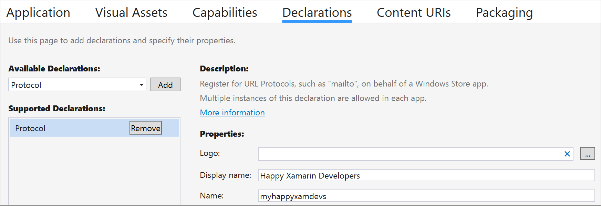

# Implement a UWP-specific version of the AzureService

> **Warning:** Complete steps in [3-CreateAnAzureServiceInTheMobileApp](./3-CreateAnAzureServiceInTheMobileApp.md) before beginning the steps below

> **Note:** If you are using Visual Studio for Mac, skip this UWP implementation

## 1. Creating AzureService.cs

1. In the Visual Studio Solution Explorer, right-click `HappyXamDevs.UWP` > **Add** > **New Folder**

2. In the Visual Studio Solution Explorer, name the new folder `Services`

3. In the Visual Studio Solution Explorer, right-click on the newly created **Services** folder > **Add** > **Class**

    - (Mac) On Visual Studio for Mac, right-click on the newly created **Services** folder > **Add** > **New File**

4. In the Add New Item window, name the new file `AzureService.cs`

5. In the **AzureService.cs** editor, enter the following code:

```cs
using System.Threading.Tasks;
using HappyXamDevs.Services;
using Microsoft.WindowsAzure.MobileServices;

[assembly: Xamarin.Forms.Dependency(typeof(HappyXamDevs.UWP.Services.AzureService))]
namespace HappyXamDevs.UWP.Services
{
    public class AzureService : AzureServiceBase
    {
        protected override Task AuthenticateUser()
        {
            return Client.LoginAsync(MobileServiceAuthenticationProvider.Facebook,
                                    "happyxamdevs");
        }
    }
}
```

> **About the Code**
>
> `Task AuthenticateUser()` calls `LoginAsync` requesting a login using Facebook. The `"happyxamdevs"` parameter is the name of the URL scheme that we registered in the Facebook App's **ALLOWED EXTERNAL REDIRECT URLS** settings
>
> `[assembly: Xamarin.Forms.Dependency(typeof(HappyXamDevs.UWP.Services.AzureService))]` is the [Xamarin.Forms dependency service](https://docs.microsoft.com/xamarin/xamarin-forms/app-fundamentals/dependency-service/?WT.mc_id=mobileappsoftomorrow-workshop-jabenn). This is a way to create a platform-specific implementation and access them from the Xamarin.Forms project. This registers a Android implementation for `IAzureService`.

## 2. Configuring the URL scheme

Just like with Android and iOS you will need to configure your app to handle the call back from the URL scheme.

1. In the Visual Studio Solution Explorer, open **HappyXamDevs.UWP** > **App.xaml.cs**

2. In the `App.xaml.cs` editor, add the `OnActivated` method:

```csharp
protected override void OnActivated(IActivatedEventArgs args)
{
    if (args.Kind is ActivationKind.Protocol)
    {
        var protocolArgs = args as ProtocolActivatedEventArgs;
        var content = Window.Current.Content as Frame;
        if (content.Content.GetType() == typeof(MainPage))
        {
            content.Navigate(typeof(MainPage), protocolArgs.Uri);
        }
    }
    Window.Current.Activate();
    base.OnActivated(args);
}
```

3. In the Visual Studio Solution Explorer, open **HappyXamDevs.UWP** > **MainPage.xaml.cs**

4. In the `MainPage.xaml.cs` editor, at the top of the file, add the following using statements:

```csharp
using HappyXamDevs.Services;
using HappyXamDevs.UWP.Services;
using Microsoft.WindowsAzure.MobileServices;
```

5. In the `MainPage.xaml.cs` editor, add the following method:

```csharp
protected override void OnNavigatedTo(NavigationEventArgs e)
{
    if (e.Parameter is Uri)
    {
        var azureService = Xamarin.Forms.DependencyService.Get<IAzureService>() as AzureService;
        azureService.Client.ResumeWithURL(e.Parameter as Uri);
    }
}
```

6. In the Visual Studio Solution Explorer, open **HappyXamDevs.UWP** > **Package.appxmanifest**

7. In the **Package.appxmanifest** editor, select the **Declarations** tab.

8. In the **Declarations** tab, open the **Available Declarations** drop-down

9. In the **Available Declarations** drop-down, select **Protocol**

10. In the **Declarations** tab, click **Add**

11. In the **Declarations** tab, in the **Supported Definitions** window, select the newly created **Protocol** declaration

12. In the **Declarations** tab, make the following selections:
    - **Display Name**: Happy Xamarin Developers
    - **Name**: happyxamdevs
    > **Note:** `Name` must match the domain of **Allowed external redirect URLs** configured in your Azure Functions

    

13. In Visual Studio, save the **Package.appxmanifest** by selecting **File** > **Save All**

## Next step

Now that your UWP app authentication has been implemented, the next step is to implement the same for Android and iOS if you haven't done so already.

* [For Android](./3_1-CreateAnAzureServiceInTheMobileAppDroid.md)
* [For iOS](./3_2-CreateAnAzureServiceInTheMobileAppIos.md)

Once you have set up authentication in all your apps, it is time to [create the Login page](./4-CreateLoginPage.md).
