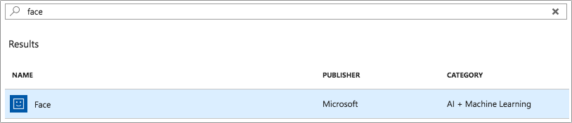
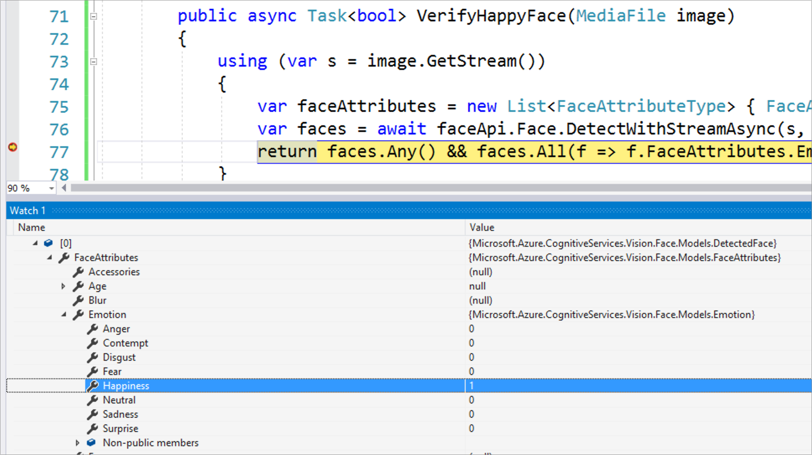

# Detect happy faces

For this app, only happy faces are allowed to be shared, so we will check that each photo contains happy faces.

We will use the power of artificial intelligence (AI), thanks to [Azure Cognitive Services FaceAPI](https://docs.microsoft.com/azure/cognitive-services/face/overview/?WT.mc_id=mobileappsoftomorrow-workshop-jabenn).

## 1. Configuring the Face API, Azure portal

1. In a browser, navigate to the [Azure Portal](https://portal.azure.com/?WT.mc_id=mobileappsoftomorrow-workshop-jabenn)

2. In the Azure Portal, navigate to the Resource Group **HappyXamDevs**

3. On the **HappyXamDevs** resource group dashboard, click **+ Add**

4. In the **Everything**, in the search bar, enter **Face**

5. On the keyboard, press the **Enter** key

6. In the search results, select **Face** from the **AI + Machine Learning**

7. In the **Face** window, click **Create**

    

8. In the **Create** window, enter the following:

    - **Name:** HappyXamDevs-Face
    - **Subscription:** [Select your subscription]
    - **Location:** West Us
    - **Pricing tier** F0
    - **Resource Group** HappyXamDevs

> **Note:** **Pricing tier** "F0" is a free tier with a limited number of API calls; it is limited to 20 calls per minute, and 30,000 per month

    

9. In the Azure Portal, navigate to the Resource Group **HappyXamDevs**

10. On the **XamHappyDevs** Resource Group dashboard, select the newly created **HappyXamDevs-Face**

11. In the **XamHappyDevs-Face** dashboard, on the left-hand menu, select **Keys**

    

12. On the **Keys** window, copy the value of `KEY 1` 
    > **Note:** We will use this value in our mobile app

13. In the **XamHappyDevs-Face** dashboard, on the left-hand menu, select **Overview**

14. In the **Overview** window, copy the base url of **Endpoint**
    - E.g. If the **Endpoint** is `https://westus.api.cognitive.microsoft.com/face/v1.0`, copy the base url, `https://westus.api.cognitive.microsoft.com/`
    > **Note:** We will use this value in our mobile app

## 2. Add Microsoft.Azure.CognitiveServices.Vision.Face NuGet Package

The Azure Cognitive Services FaceAPI is accessible from a NuGet package that provides wrappers around the available services. This can be used to detect faces in your photo.

1. Open the Xamarin.Forms app in Visual Studio

    > **Note:** The completed app from Section 1 is available in **FinishedWorkshopSteps** > **1-CreateSolution**

2. (PC) In Visual Studio, right-click the `HappyXamDevs` solution > **Manage NuGet Packages For Solution..**

    - (Mac) In Visual Studio for Mac, right-click the `HappyXamDevs` project > **Add** > **Add NuGet Packages**

3. (PC) In the **NuGet Package Manager** window, select **Browse**

    - (Mac) _Skip this step_

4. (PC) In the **NuGet Package Manager** window, check **Include prerelease**

    - (Mac) In the **NuGet Package Manager**, check **Show pre-release packages**

5. In the **NuGet Package Manager** window, in the search bar, enter **Microsoft.Azure.CognitiveServices.Vision.Face**

6. In the **NuGet Package Manager** window, in the search results, select **Microsoft.Azure.CognitiveServices.Vision.Face**

6. (PC) In the **NuGet Package Manager** window, select **Install**

    - (Mac) In the **NuGet Package Manager** window, select **Add Package**

7. (PC) _Skip this step_

    - (Mac) In Visual Studio for Mac, right-click the `HappyXamDevs.Android` project > **Add** > **Add NuGet Packages**

8. (PC) _Skip this step_

    - (Mac) In the **NuGet Package Manager** window, in the search results, select **Microsoft.Azure.CognitiveServices.Vision.Face**


9. (PC) _Skip this step_

    - (Mac) In the **NuGet Package Manager** window, select **Add Package**

10. (PC) _Skip this step_

    - (Mac) In Visual Studio for Mac, right-click the `HappyXamDevs.iOS` project > **Add** > **Add NuGet Packages**

11. (PC) _Skip this step_

    - (Mac) In the **NuGet Package Manager** window, in the search results, select **Microsoft.Azure.CognitiveServices.Vision.Face**

12. (PC) _Skip this step_

    - (Mac) In the **NuGet Package Manager** window, select **Add Package**

### 3. Create `VerifyHappyFace`

1. In the Visual Studio Solution Explorer, open **HappyXamDevs** > **Services** > **IAzureService.cs**

2. In the **IAzureService.cs** editor, enter the following code:

```csharp
using System.Threading.Tasks;
using Plugin.Media.Abstractions;

namespace HappyXamDevs.Services
{
    public interface IAzureService
    {
        bool IsLoggedIn();
        Task<bool> Authenticate();
        Task<bool> VerifyHappyFace(MediaFile photo);
    }
}
```

3. In the Visual Studio Solution Explorer, open **HappyXamDevs** > **Services** > **AzureServiceBase.cs**

4. In the **AzureServiceBase.cs** editor, add the following using statements:

```csharp
using System.Linq;
using System.Collections.Generic;
using Microsoft.Azure.CognitiveServices.Vision.Face;
using Microsoft.Azure.CognitiveServices.Vision.Face.Models;
using Plugin.Media.Abstractions;
```

5. In the **AzureServiceBase.cs** editor, add the following `readonly` field:

```csharp
private readonly FaceClient faceApiClient = new FaceClient(new ApiKeyServiceClientCredentials("[YOUR API KEY HERE]"))
{
    Endpoint = "[YOUR FACE API BASE URL]"
};
```
> **Note:** Replace `[Your API Key]` with the value from `KEY 1`
>
> **Note:** Replace `[Your Face API Base Url]` with the base url of the **Face API** **Overview** `Endpoint`

- **Warning:** Do not use the full URL; only use the base url

    - **Correct Example:** `https://westus.api.cognitive.microsoft.com/`
    - **Incorrect Example:** `https://westus.api.cognitive.microsoft.com/face/v1.0`

6. In the **AzureServiceBase.cs** editor, add the following method:

```csharp
public async Task<bool> VerifyHappyFace(MediaFile photo)
{
    using (var photoStream = photo.GetStream())
    {
        var faceAttributes = new List<FaceAttributeType> { FaceAttributeType.Emotion };

        var faces = await faceApiClient.Face.DetectWithStreamAsync(photoStream, returnFaceAttributes: faceAttributes);

        return faces.Any(f => f.FaceAttributes.Emotion.Happiness > 0.75);
    }
}
```

> ** About the Code**
>
> `using (var photoStream = photo.GetStream())` creates an object, `photoStream`, using the photo from the user
>
> `faceApi.Face.DetectWithStreamAsync` returns the emotion results from the Face API
>
> `faces.Any(f => f.FaceAttributes.Emotion.Happiness > 0.75)` searches the Face API results for `Happiness` value above 0.75; 0.75 is a confidence interval indicating that there is a 75% chance a happy face was found in the photo

### 4. Add Face Detection to `MainViewModel.cs`

Now that you have a method on your Azure service to detect a happy face, you can call this in your main view model to validate that the photo contains happy faces. Open the `MainViewModel` class.

1. In the Visual Studio Solution Explorer, open **HappyXamDevs** > **ViewModels** > **MainViewModel.cs**

2. In the **MainViewModel.cs** editor, enter the following code:

```csharp
using System.Threading.Tasks;
using System.Windows.Input;
using HappyXamDevs.Services;
using Plugin.Media;
using Plugin.Media.Abstractions;
using Xamarin.Forms;

namespace HappyXamDevs.ViewModels
{
    public class MainViewModel : BaseViewModel
    {
        readonly IAzureService azureService;

        public MainViewModel()
        {
            TakePhotoCommand = new Command(async () => await TakePhoto());
            SelectFromLibraryCommand = new Command(async () => await SelectFromLibrary());
            azureService = DependencyService.Get<IAzureService>();
        }

        public ICommand SelectFromLibraryCommand { get; }
        public ICommand TakePhotoCommand { get; }

        private async Task SelectFromLibrary()
        {
            var options = new PickMediaOptions { PhotoSize = PhotoSize.Medium };
            var photo = await CrossMedia.Current.PickPhotoAsync(options);

            if (await ValidatePhoto(photo))
                return;
        }

        private async Task TakePhoto()
        {
            var options = new StoreCameraMediaOptions { PhotoSize = PhotoSize.Medium };
            var photo = await CrossMedia.Current.TakePhotoAsync(options);

            if (await ValidatePhoto(photo))
                return;
        }

        private async Task<bool> ValidatePhoto(MediaFile photo)
        {
            if (photo is null)
                return false;

            var isHappy = await azureService.VerifyHappyFace(photo);

            if (isHappy)
                return true;

            await Application.Current.MainPage.DisplayAlert("Sad panda",
                                                "I can't find any happy Xamarin developers in this picture. Please try again.",
                                                "Will do!");
            return false;
        }
    }
}
```

## 5. Run the code

Run this code through the debugger, with a break point in the `VerifyHappyFaces` method to see what comes back from the call to `DetectInStreamAsync`.



## Next step

Now that your app can take photos and verify that they are of happy developers, the next step is to [configure storage in Azure using Blob storage and CosmosDB](./7-ConfigureStorage.md) so that you have somewhere to upload your photos to.