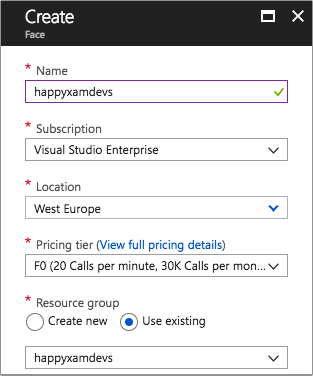

# Detect happy faces

For this app, only happy faces are allowed to be shared, so you will need to check that the photo taken or selected by the user contains faces and that they are all happy. You can do this using the power of artificial intelligence (AI), thanks to [Azure Cognitive Services FaceAPI](https://docs.microsoft.com/azure/cognitive-services/face/overview/?WT.mc_id=mobileappsoftomorrow-workshop-jabenn).

## Configuring the Face API in the Azure portal

1. In the [Azure Portal](https://portal.azure.com/?WT.mc_id=mobileappsoftomorrow-workshop-jabenn), add a new resource. Search for "Face" and select _Face_ from the _AI + Machine Learning_ category. Then click "Create".

    

2. In the _Create_ blade, enter a name for the service, such as "HappyXamDevs-Face", select your Azure subscription, and select the Azure region closest to you. For the _Pricing tier_, set this to "F0", a free tier with limited calls but well within what we need for this workshop (at the time of writing this is limited to 20 calls per minute, and 30,000 per month). For the _Resource Group_, select "Use Existing" and choose the resource group you created when setting up your function app. Then check _Pin to Dashboard_ to make this easy to find and click "Create".

    

    > You can only have one F0 price tier resource per Cognitive Service per subscription - so one for Face, one for Computer Vision and so on. If you've already got a Face resource configured as F0 you will not be able to provision another one, so either use S0 (which at the time of writing is $0.75 per 1000 calls) or re-use your existing resource.

3. Select the "HappyXamDevs-Face" service that you just created in the portal, and click on Keys.
    

4. Copy the `KEY 1` from the portal. You will use it later in the Xamarin application.

## Looking for faces in the mobile app

The Azure Cognitive Services FaceAPI is accessible from a NuGet package that provides wrappers around the available services. This can be used to detect faces in your photo.

1. Install the ["Microsoft.Azure.CognitiveServices.Vision.Face"](https://www.nuget.org/packages/Microsoft.Azure.CognitiveServices.Vision.Face) NuGet package into all the projects in your Xamarin app. At the time of writing this is pre-release, so check the _Pre-release_ (or _Include prerelease_) checkbox.

### Adding happy face detection to the Azure service

1. In the `IAzureService` interface (in the Services folder), add a method signature to look for happy faces in a photo, called `VerifyHappyFace`. This should be an asynchronous method that takes a `MediaFile`, the type returned by the media plugin when you take or select a photo, and return a boolean. The value `true` means that the image contains faces that are all happy. The value `false` means either that no faces were detected, or that the faces were not happy. You will need to add a using directive for the `Plugin.Media.Abstractions` namespace.

    ```cs
    Task<bool> VerifyHappyFace(MediaFile photo);
    ```

2. In the `AzureServiceBase` class, declare a field of type `FaceAPI`. You will need to add a using statement for the `Microsoft.Azure.CognitiveServices.Vision.Face` namespace.

    ```cs
    FaceAPI faceApi;
    ```

3. In the constructor for the `AzureServiceBase` class, create some API key credentials using the API key of your Face service that you copied earlierfrom the Azure portal. Use these credentials to initialize the `FaceAPI` field, and set the region property on this object to match the region you selected when setting up the service. The code below shows this using a made up key and assuming the region is West Europe. You will need to add a using directive for the `Microsoft.Azure.CognitiveServices.Vision.Face.Models` namespace.

    ```cs
    var creds = new ApiKeyServiceClientCredentials("YourAPIKeyHere");
    faceApi = new FaceAPI(creds)
    {
        AzureRegion = AzureRegions.Westeurope
    };
    ```

    > In a production app you wouldn't hard code the key inside the app. Instead you would use something like [Azure Key Vault](https://docs.microsoft.com/azure/key-vault/?WT.mc_id=mobileappsoftomorrow-workshop-jabenn), or at the very least use an authenticated Azure Function to retrieve the key.

4. Implement the `VerifyHappyFace` method as an async method. You will need to add a using directive for the `Plugin.Media.Abstractions` namespace.

    ```cs
    public async Task<bool> VerifyHappyFace(MediaFile photo)
    {
    }
    ```

5. In this method, get a stream from the photo and pass it to the `DetectWithStreamAsync` method. This method takes a `Stream` containing an image and returns any detected faces. You can also pass a list of attributes on the face you are interested in to the `returnFaceAttributes` parameter, for example the angle of the face, the age of the face, if the face has make up or glasses on. The attribute we want is the emotion shown by the face, so you will need to pass a list of `FaceAttributeType` containing just `FaceAttributeType.Emotion`.

    ```cs
    using (var s = photo.GetStream())
    {
        var faceAttributes = new List<FaceAttributeType> { FaceAttributeType.Emotion };
        var faces = await faceApi.Face.DetectWithStreamAsync(s, returnFaceAttributes: faceAttributes);
    }
    ```

6. The call to `DetectWithStreamAsync` returns an `IList<DetectedFace>`, a list of detected face. Each `DetectedFace` will have a `FaceAttributes` collection containing the attributes requested, so in your case it will have the emotion as a `double` value. This value is between 0 and 1 and corresponds to a percentage from 0% to 100%. In your case, the `Emotion` attribute will have values for each emotion on a scale of 0 to 1 showing the percentage chance that the face is showing that emotion. You will need to check that faces have been found, and all faces have a happiness value over a certain threshold - such as 75%. The `System.Linq` namespace has extension methods to help with this, so add the appropriate using directive.

    ```cs
    return faces.Any() && faces.All(f => f.FaceAttributes.Emotion.Happiness > 0.75);
    ```

The final code for this function in the service is shown below.

```cs
public async Task<bool> VerifyHappyFace(MediaFile photo)
{
    using (var s = photo.GetStream())
    {
        var faceAttributes = new List<FaceAttributeType> { FaceAttributeType.Emotion };
        var faces = await faceApi.Face.DetectWithStreamAsync(s, returnFaceAttributes: faceAttributes);
        return faces.Any() && faces.All(f => f.FaceAttributes.Emotion.Happiness > 0.75);
    }
}
```

### Detecting happy faces from the view model

Now that you have a method on your Azure service to detect a happy face, you can call this in your main view model to validate that the photo contains happy faces. Open the `MainViewModel` class.

1. Add a field of type `IAzureService`. You will need to add a using directive for the `HappyXamDevs.Services` namespace.

    ```cs
    IAzureService azureService;
    ```

2. In the constructor, initialize this field using the `DependencyService`.

    ```cs
    public MainViewModel()
    {
        ...
        azureService = DependencyService.Get<IAzureService>();
    }
    ```

3. Add a new asynchronous method to the view model called `ValidatePhoto` that takes a `MediaFile` and returns a boolean value.

    ```cs
    async Task<bool> ValidatePhoto(MediaFile photo)
    {
    }
    ```

4. In this method, first check that the `photo` is not `null` (which would be the case if the user cancels taking the picture). Then pass the image to the new method on the Azure service, storing the return value.

    ```cs
    if (photo == null) return false;
    var isHappy = await azureService.VerifyHappyFace(photo);
    ```

5. If happy faces are found, this method should return `true`.

    ```cs
    if (isHappy) return true;
    ```

6. If the photo does not contain any happy faces, the user should be notified so they can take the photo again. Alerts can be shown to the user using the `DisplayAlert` method available on any page. You can access the current page using the static `Application.Current.MainPage` property, and call display alert from there. After alerting the user, this method should return `false`.

    ```cs
    await Application.Current.MainPage.DisplayAlert("Sad panda",
                                                    "I can't find any happy Xamarin developers in this picture. Please try again.",
                                                    "Will do!");
    return false;
    ```

    > You would not normally call this method directly in your view models as it is not unit-testable. In a production app you would put a layer of abstraction over the top of this call.

7. Add a check to validate the image to both the `TakePhoto` and `SelectFromLibrary` methods, returning if the image is not validated. In a later step you will add code to upload the image using an Azure Function if this check is successful.

    ```cs
    async Task TakePhoto()
    {
        ...
        if (!await ValidatePhoto(photo)) return;
    }

    async Task SelectFromLibrary()
    {
        ...
        if (!await ValidatePhoto(photo)) return;
    }
    ```

Run this code through the debugger, with a break point in the `VerifyHappyFaces` method to see what comes back from the call to `DetectInStreamAsync`.


## Next step

Now that your app can take photos and verify that they are of happy developers, the next step is to [configure storage in Azure using Blob storage and CosmosDB](./7-ConfigureStorage.md) so that you have somewhere to upload your photos to.