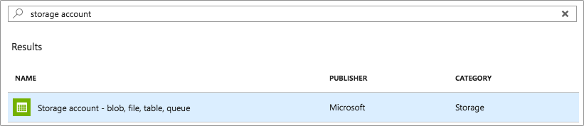
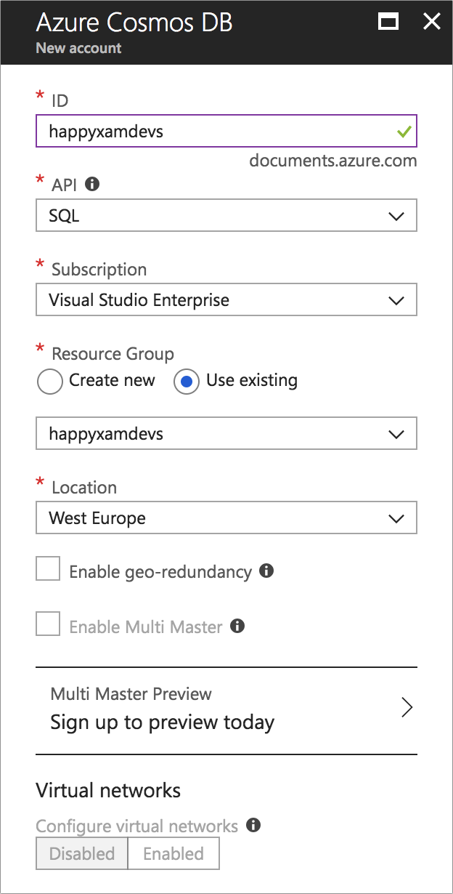
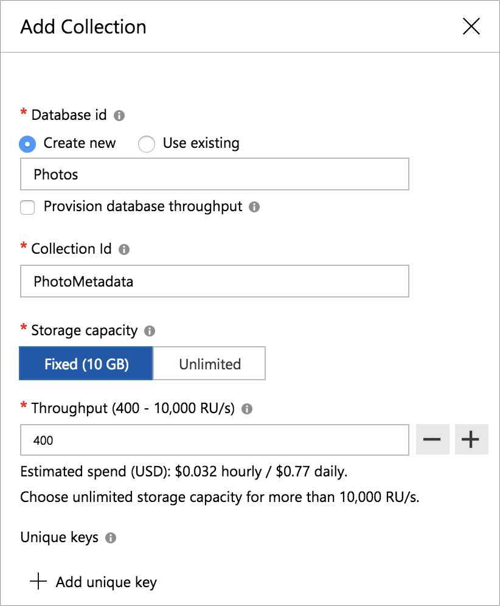

# Configure storage

We now have an app that can take a photograph and check for happy faces. You now need to be able to upload this photo to Azure so it can be shared with other users of your app. For this you will be using two types of storage that you will configure from the Azure portal - [blob storage](https://docs.microsoft.com/azure/storage/?WT.mc_id=mobileappsoftomorrow-workshop-jabenn) to store the actual photos as raw binary blobs (Binary Large OBject), and [Cosmos DB](https://docs.microsoft.com/azure/cosmos-db/?WT.mc_id=mobileappsoftomorrow-workshop-jabenn) to save metadata about each image.

## Setting up blob storage

The first type of storage to set up is blob storage to store photos.

### Creating the blob storage resource

1. Head to the [Azure Portal](https://portal.azure.com/?WT.mc_id=mobileappsoftomorrow-workshop-jabenn) and click the _Create Resource_ button (the green + if your sidebar is collapsed).
2. Search for "storage account", select _Storage account - blob, file, table, queue_, then click "Create".

    

3. Enter a name for your blob storage. This will need to be unique across the whole of Azure as this will become an actual sub-domain of `core.windows.net`. The edit control has a built in validator-if the app name is unique you will see a green tick on the right.
4. Leave the _Deployment model_ as "Resource manager".
5. Set the _Account Kind_ to "Blob Storage".
6. Set the location to be the closest region to you.
7. Leave the _Replication_, _Performance_, _Access tier_, and _Secure Transfer Required_ fields as the default value.
8. Select your subscription.
9. Set the _Resource Group_ to use the existing resource group you set up for the Azure Functions app.
10. Check the _Pin to dashboard_ checkbox.
11. Click "Create".

    

### Configure a container

Blob storage has a concept of named containers that blobs can be stored in. Containers can be created in code, but during this workshop it will be easier to create one in the portal.

1. Open the new storage account from the Azure portal dashboard.
2. Select _Blob Service->Browse blobs_ from the left-hand menu.
3. Click _+ Container_ from the top menu.
4. Set the _Name_ as "photos", and leave the _Public access level_ as "Private (no anonymous access)", then click "OK".

    

## Setting up Cosmos DB

The second type of storage to configure is Cosmos DB. This is a NoSql database that you can use to store metadata about the photos being uploaded.

1. Create a new resource in the Azure portal.
2. Search for "Cosmos DB", select _Azure Cosmos DB_ then click "Create".

    

3. Enter a name for your Cosmos DB. This will need to be unique across the whole of Azure as this will become an actual sub-domain of `documents.azure.com`. The edit control has a built in validator-if the app name is unique you will see a green tick on the right.

4. For the _API_, select "SQL".

    > The different APIs have different ways for you to access and query your data, and have different capabilities. The SQL API allows you to query your data using SQL, and supports binding to Azure Functions, something you will do in later parts.

5. Select your subscription, set the resource group to the existing one you are already using, and set the location to the closest region to you. Leave the rest of the options as their defaults.
6. Check the _Pin to dashboard_ checkbox, then click "Create". This resource may take a few minutes to provision.

    

### Configure the database

The SQL API for Cosmos DB allows you to create databases, and inside a database create a collection to put documents into. You will need to create a database and container now in the portal.

1. Open the Cosmos DB resource from the Azure Portal.
2. Select _Data Explorer_ from the left-hand menu.
3. Click the "New Collection" button.
4. For the _Database_, select "Create new" and set the database name to be "Photos".
5. For the _Collection ID_ use "PhotoMetadata".
6. Set the storage as fixed, and set the _Throughput_ to 400, the minimum value (this is to reduce the cost of running this collection).
7. Click "OK".

    

## Next step

Now that you have storage configured, the next step is to [create an Azure Function to save the photos to blob storage](./8-FunctionToSavePhotos.md).