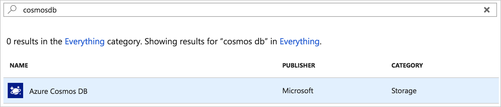

# Configure Azure Storage

We now have an app that can take a photograph and check for happy faces.

We now need to be able to upload this photo to Azure so it can be shared with other users of our app. For this we will be using two types of storage that you will configure from the Azure portal - [blob storage](https://docs.microsoft.com/azure/storage/?WT.mc_id=mobileappsoftomorrow-workshop-jabenn) to store the actual photos as raw binary blobs (Binary Large OBject), and [Cosmos DB](https://docs.microsoft.com/azure/cosmos-db/?WT.mc_id=mobileappsoftomorrow-workshop-jabenn) to save metadata about each image.

## 1. Create a Container in Azure Blob Storage

In Azure Blob Storage, blobs are stored in containers, similar to how a folder holds files on a PC. We will be creating our container using the Azure Portal UI, but containers can also be created in code.

1. In the [Azure Portal](https://portal.azure.com/?WT.mc_id=mobileappsoftomorrow-workshop-jabenn), navigate to the Azure Storage resource, **xamhappydevsstorage**

2. On the **Azure Storage** page, on the left-hand menu, select **Blobs**
3. On the **Blobs** page, select **+ Container**
4. In the **New Container** window, enter the following"

    - **Name**: photos
    - **Public access level**: Private (no anonymous access)

5. In the **New Container** window, click **OK**

    

## 2. Create Azure Cosmos DB Instance

The second type of storage to configure is Cosmos DB. This is a NoSQL database that we will use to store metadata about the uploaded photos.

1. On the Azure Portal, click the **+ Create Resource** button
    > **Note:** The **+ Create Resource** button will be a green **+** if the sidebar is collapsed

2. In the **New** page, in the search bar, enter **Cosmos Db**
3. On the keyboard, press the **Return** key
4. In the search results, select **Azure Cosmos DB**

    

5. In the **Azure Cosmos Db** pane, click **Create**
6. In the **Create Azure Cosmos DB Account** page, enter the following:
    - **Subscription:** [Select Your Azure Subscription]
    - **Resource Group:** HappyXamDevs
    - **Account Name:** happyxamdevs-[Your Last Name]
        - E.g. happyxamdevs-minnick
    > **Note:** The Storage Account Name must be unique because it is  used as the subdomain for our Azure Cosmos Db url
    - **API:** Core (SQL)
    > **Note:** Thfe different APIs have different ways for you to access and query your data, and have different capabilities. The SQL API allows us to query our data using SQL, and supports binding to Azure Functions which we will do in a later section
    - **Location:** WestUS
    - **GeoRedundancy** Disable
    - **Multi-region Writes** Disable

7. In the **Create Azure Cosmos DB Account** page, click **Review + create**
8. In the **Create Azure Cosmos DB Account** page, click **Create**

## 3. Configure CosmosDb

We will create a database that contains a collection in which we will add our photos metadata.

1. In the [Azure Portal](https://portal.azure.com/?WT.mc_id=mobileappsoftomorrow-workshop-jabenn), navigate to the newly created Cosmos Db resource, **happyxamdevs-[Your Last Name]**
    - E.g. happyxamdevs-minnick

2. On the **CosmosDb** page, on the left-hand menu, select **Data Explorer**
3. In the **Data Explorer** page, click **New Collection**
4. In the **New Collection** pane, enter the following:
    - **Database id:** Create New
    - **Type a new database id:** Photos
    - **Collection Id:** PhotoMetadata
    - **Partition Key:** /name
    - **Throughput:** 400
 
5. In the **New Collection** pane, click **OK**

## Next step

Now that you have storage configured, the next step is to [create an Azure Function to save the photos to blob storage](./8-FunctionToSavePhotos.md).