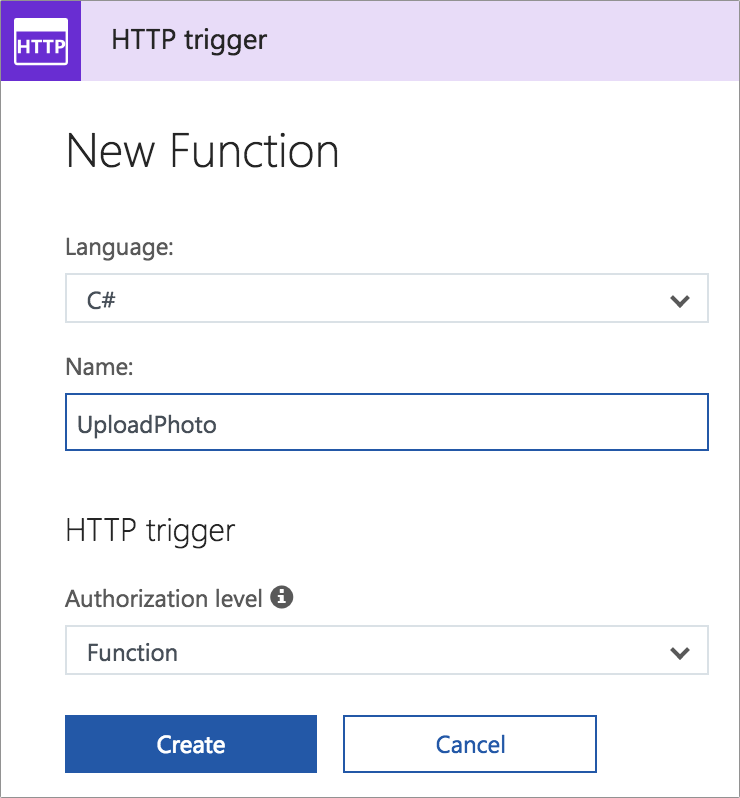

# Create an Azure Function to save photos to blob storage

Now that you have blob storage configured, you need a way to put images into this storage. Although it is possible to make your blob storage publicly writable from your app, this is a security hole. It is better to use a function to write to the blob storage instead, as this function can be secured behind the Facebook authentication you set up earlier in this workshop.

In this section you will be creating and configuring Azure Functions from inside the portal as this is the quickest way to get going. In a real world app you would develop these functions using [Visual Studio](https://docs.microsoft.com/azure/azure-functions/functions-develop-vs/?WT.mc_id=mobileappsoftomorrow-workshop-jabenn), or [Visual Studio Code](https://code.visualstudio.com/?WT.mc_id=mobileappsoftomorrow-workshop-jabenn) using the [Azure Functions Extension](https://marketplace.visualstudio.com/items?itemName=ms-azuretools.vscode-azurefunctions&WT.mc_id=mobileappsoftomorrow-workshop-jabenn).

## Creating your first Azure Function

Azure Functions are started by [triggers](https://docs.microsoft.com/azure/azure-functions/functions-triggers-bindings/?WT.mc_id=mobileappsoftomorrow-workshop-jabenn). These include timer triggers (scheduler), HTTP triggers that are invoked when a request is made to a web endpoint, Blog triggers and more.

HTTP triggers are an incredibly useful way of building a REST service, and you can use one of these to create a function endpoint that your app can call, passing the photo. REST APIs usually have named endpoints (URLs) that you can query using HTTP methods such as GET or POST. Ideally you API should follow this standard. The API you will be building will be:

`https://<YourFunctionApp>.azurewebsites.net/api/photo`

By the end of this workshop you will be able to send a request using the GET method to this API to get the entire collection of photos. You will also be able to send a GET to `/api/photo/{name}` to get an individual photo by name, and to POST a photo to `/api/photo`.

In this step you will be implementing the POST method.

Azure Functions are named functions, so you would name them based off a naming convention that makes sense to you. You can then set up a [_Route Template_](https://docs.microsoft.com/en-gb/azure/azure-functions/functions-bindings-http-webhook?WT.mc_id=mobileappsoftomorrow-workshop-jabenn#customize-the-http-endpoint) to assign a REST resource and HTTP method combination to a function. For example you can create a function called "GetPhotos" and assign this to all GET requests made to `/api/photo`.

### Creating the Azure Function

1. inside the Azure Portal, open your Azure Function App.
2. Click on the _Functions_ node on the left, then click the _+_ that appears next to it.
3. Click "Custom Function" under _Get Started on your own_.
4. Click "C#" on the _HTTP Trigger_ panel.
5. Leave the _Language_ as C#, set the _Name_ to be "UploadPhoto" and leave the _Authorization Level_ as "Anonymous". Then click "Create".

    > Although this is anonymous, this function is still behind the Facebook authentication you set up earlier, so can only be called by users who are logged in.

    

### Configuring the Azure function

By default, HTTP triggers support GET and POST methods. This function will only need to support POST. It will also need to be configured to be called using the `photo` resource

1. Expand the _UploadPhoto_ node under the _Functions_ node in the left-hand menu, and select the _Integrate_ node.
2. Set the _Route Template_ to "photo".
3. In the _Selected HTTP Methods_ section, un-check GET so that only POST is selected. Then click "Save".

    

### Adding a connection string to the Function app settings

To connect to blob storage, the function needs a connection string. Rather than hard-coding this, it can be configured as an application setting.

1. In the Azure Portal, head to the Blob storage resource you configured in the previous section.
2. Select _Settings->Access Keys_ and copy the _Connection String_ from either _Key1_ or _Key2_ (it doesn't matter which).
3. Head back to your Azure Functions App and select the Functions app itself in the left-hand menu.
4. From the _Overview_ tab, click the "Application Settings" option.

    

5. In the _Application Settings_ section in the _Application Settings_ tab you will see some key-value pairs of settings. Click the "+ Add New Setting" option, set the name as "BlobStorageConnectionString", and paste the connection string you copied earlier into the value field. Then click "Save" on top of the page.

    

### Writing the code

The mobile app will need to send the photo to this function. One easy way to do it is to Base64 encode the binary image data (so that it becomes a `string`), then send this as part of a JSON payload. This method allows you in the future to extend the data being set by adding more fields.

The JSON document you will send will be a list of name/value pairs and will have the following format:

```json
{
    "Photo" : "<Base64 encoded photo>"
}
```

You'll actually implement the sending of this data later in this part, but for now you can set up the function to be ready to receive it. The `"photo"` value will be retrieved from the HTTP request, converted back to binary data and saved into Blob storage. To access Blob storage, you will need to add a NuGet package to the function.

1. Select the top-level _UploadPhoto_ function from the menu on the left.
2. To add the NuGet package you will need to add a new file called `project.json`. Select _View Files_ from the right-hand side, click the "Add" button, enter "project.json" as the file name and press return.

    

3. This file will open in the editor, so add the following to add the "WindowsAzure.Storage" NuGet package to the function. The click "Save".

    ```json
    {
        "frameworks": {
            "net46":{
                "dependencies": {
                    "WindowsAzure.Storage": "9.1.1"
                }
            }
        }
    }
    ```

4. From the _View Files_ pane, select the _run.csx_ file. This is a C# script file that contains the code that gets run by the function. This script file contains a single async method called `Run` that takes a `HttpRequestMessage` containing the request used to make the call to this function, and returns a `HttpResponseMessage` with the return status of the call. The default new function contains a basic "Hello World" style function, so you can start by deleting all the code in this method.

5. When data is sent in a JSON document with name/value pairs, you can easily extract the values by reading the content as a dynamic object, taking advantage of C#'s [dynamic keyword](https://docs.microsoft.com/dotnet/csharp/programming-guide/types/using-type-dynamic/?WT.mc_id=mobileappsoftomorrow-workshop-jabenn). Once a JSON payload is converted to a dynamic object, you can access the items in it as if they were properties of an object. The following code reads the HTTP request body into a dynamic variable, and extracts the `Photo` item as a `string`.

    ```cs
    dynamic data = await req.Content.ReadAsAsync<object>();
    string photo = data?.Photo;
    ```

    > It is important to specify the type of the `photo` variable instead of using `var` otherwise a dynamic type is used. The explicit `string` variable type ensures the `Photo` property is read as a string.

6. The `photo` string can be converted back to binary data using the static `Convert.FromBase64String` method.

    ```cs
    var imageBytes = Convert.FromBase64String(photo);
    ```

7. To upload the image to Blob storage, you will need a connection to the relevant Blob storage resource using the connection string saved in your Function App settings. Add the following code to get the connection string. You will need to add a using directive to the top of the file for `System.Configuration`.

    ```cs
    var connectionString = ConfigurationManager.AppSettings["BlobStorageConnectionString"];
    ```

8. Next, add the following code to create a connection to Blob storage. You will also need to add using directives for `Microsoft.WindowsAzure.Storage` and `Microsoft.WindowsAzure.Storage.Blob` to the top of the script file.

    ```cs
    CloudStorageAccount storageAccount;
    CloudStorageAccount.TryParse(connectionString, out storageAccount);
    ```

    This code will create a new instance of the `CloudStorageAccount` class connected to your Blob storage account.

9. Using the connection, you can get access to the "photos" container by creating a Blob client and accessing the container from there.

    ```cs
    var blobClient = storageAccount.CreateCloudBlobClient();
    var blobContainer = blobClient.GetContainerReference("photos");
    ```

10. Create a new Blob reference inside the container that you can put the photo into. This reference needs a unique name so create a new Guid and use that as the blob name. The Blob can be configured to store JPEG data.

    ```cs
    var blobName = Guid.NewGuid().ToString();
    var blob = blobContainer.GetBlockBlobReference(blobName);
    blob.Properties.ContentType = "Jpeg";
    ```

11. Upload the image bytes to the Blob.

    ```cs
    await blob.UploadFromByteArrayAsync(imageBytes, 0, imageBytes.Length);
    ```

12. Finally return an HTTP result status of __200 - OK__. Click "Save" to save your changes to the function.

    ```cs
    return req.CreateResponse(HttpStatusCode.OK);
    ```

    > Because the Function app uses authentication, you won't be able to test this function directly using the _Run_ option inside the portal, unless you turn authentication off at the Function app level. If you do this, remember to turn authentication back on once you are done.

The full code of this function is below.

```cs
using System.Configuration;
using System.Net;
using Microsoft.WindowsAzure.Storage;
using Microsoft.WindowsAzure.Storage.Blob;

public static async Task<HttpResponseMessage> Run(HttpRequestMessage req, TraceWriter log)
{
    dynamic data = await req.Content.ReadAsAsync<object>();
    string photo = data?.Photo;
    var imageBytes = Convert.FromBase64String(photo);

    var connectionString = ConfigurationManager.AppSettings["BlobStorageConnectionString"];
    CloudStorageAccount storageAccount;
    CloudStorageAccount.TryParse(connectionString, out storageAccount);

    var blobClient = storageAccount.CreateCloudBlobClient();
    var blobContainer = blobClient.GetContainerReference("photos");

    var blobName = Guid.NewGuid().ToString();
    var blob = blobContainer.GetBlockBlobReference(blobName);
    blob.Properties.ContentType = "Jpeg";

    await blob.UploadFromByteArrayAsync(imageBytes, 0, imageBytes.Length);

    log.Info($"Blob {blobName} created");

    return req.CreateResponse(HttpStatusCode.OK);
}
```

## Calling the function from the mobile app

When you create an Azure Function, the API end point for the function defaults to `https://<FunctionsAppName>.azurewebsites.net/api/<FunctionName>` or `https://<FunctionsAppName>.azurewebsites.net/api/{Route template}`, for example the photo upload function for a Function app called "happyxamdevs" would be `https://happyxamdevs.azurewebsites.net/api/UploadPhoto` or `https://<FunctionsAppName>.azurewebsites.net/api/photo`. To call this function you would need to make a POST to this end point passing a JSON payload with the photo encoded as Base64, and because it is behind authentication you would also need to pass an authentication token as an HTTP header.

To make it easier to use Azure Functions, the `MobileClient` class you used earlier to authenticate provides a way to call an API - essentially any function in the `api` path, and it will automatically pass the required authentication headers for you. All you have to do is call a method on the mobile client, passing the HTTP method you want to use, the function name and the payload.

### Adding a method to the Azure Service to upload a photo

1. Head back to the Xamarin app and open the `IAzureService` interface. Add a new method to this interface to upload a photo.

    ```cs
    Task UploadPhoto(MediaFile photo);
    ```

2. Open the `AzureServiceBase` implementation of this interface and add a constant to this class for the name of the photo REST resource.

    ```cs
    const string PhotoResource = "photo";
    ```

3. Add a skeleton for the new `UploadPhoto` method.

    ```cs
    public async Task UploadPhoto(MediaFile photo)
    {
    }
    ```

4. In this method, get the image from the `MediaFile` as a stream, and extract the image as bytes.

    ```cs
    using (var s = photo.GetStream())
    {
        var bytes = new byte[s.Length];
        await s.ReadAsync(bytes, 0, Convert.ToInt32(s.Length));
    }
    ```

5. To create the JSON payload, you can create an [anonymous type](https://docs.microsoft.com/dotnet/csharp/programming-guide/classes-and-structs/anonymous-types/?WT.mc_id=mobileappsoftomorrow-workshop-jabenn) with a field called `photo`.

    ```cs
    var content = new
    {
        Photo = Convert.ToBase64String(bytes)
    };
    ```

6. Next you need to serialize this to JSON. The best tool to handle JSON is the [Newtonsoft.Json](https://www.nuget.org/packages/Newtonsoft.Json/) NuGet package, and this is already installed for you as a dependency of the Azure mobile client package. You will need to add a using directive for the `Newtonsoft.Json.Linq` namespace.

    ```cs
    var json = JToken.FromObject(content);
    ```

7. Finally, use the mobile client to make an authenticated call to the Azure Function, passing the JSON payload. The `InvokeApiAsync` method is used to invoke methods in the `/api/` path, so only needs the resource name.

    ```cs
    await Client.InvokeApiAsync(PhotoResource, json);
    ```

    > By default when you use this overload that calls a function and passes data, the HTTP call is always a POST so there is no need to specify the method. If you did want to use a different method (for example a PUT to update a resource), you can add this as an additional parameter.

The full code for this method is shown below.

```cs
public async Task UploadPhoto(MediaFile photo)
{
    using (var s = photo.GetStream())
    {
        var bytes = new byte[s.Length];
        await s.ReadAsync(bytes, 0, Convert.ToInt32(s.Length));

        var content = new
        {
            Photo = Convert.ToBase64String(bytes)
        };

        var json = JToken.FromObject(content);
        await Client.InvokeApiAsync(PhotoResource, json);
    }
}
```

### Using this method to upload a photo

1. Open the `MainViewModel`. Add a call to the new `UploadPhoto` method to the end of both the `TakePhoto` and `SelectFromLibrary` methods, after the validation check.

    ```cs
    await azureService.UploadPhoto(photo);
    ```

## Test it out

Run the app on your platform of choice and take a photograph or select one from your library (ensuring of course it has happy Xamarin developers in it). You can see the function being called by opening the function in the Azure Portal and expanding the _Log_ tab before the Azure Function is called - this will show a live log of calls being made.

> If you want more details on what the function is doing you can add log statements. Every function is passed a `TraceWriter log` parameter, and this `log` parameter has methods to log out `Debug`, `Info` or `Error` messages. If you want more detail on what your function is doing add some log statements and save the function, before running you app again.

Once a photo has been uploaded you can see it by selecting the Blob storage resource, selecting _Browse blobs_, and selecting the _photos_ collection.


> This app doesn't include any feedback whilst the photo is being uploaded. In a production quality app you should provide feedback during the upload and once it has completed (and show any errors if it fails, such as due to connection issues).

## Next step

Now that you have a function to write photos to Blob storage that is called from your mobile app, the next step is to [create a blob storage trigger to analyze the photos and save the results to Cosmos DB](./9-BlobStorageTrigger.md).